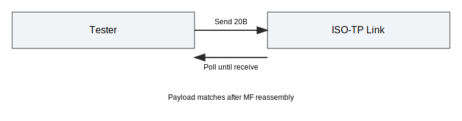
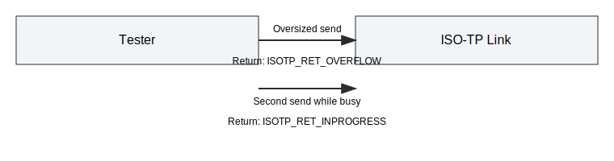
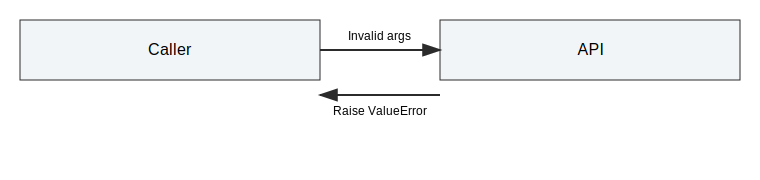
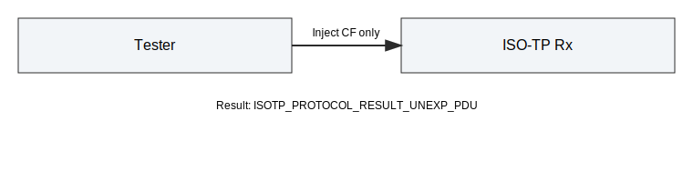

# API Endpoints Integration Tests

This document describes the API endpoint coverage tests for the Python bindings.
The suite acts as a targeted smoke test plus edge-case checks not covered in other files.

## Scope

The tests in tests/integration/test_api_endpoints.py cover:

- Basic API smoke for single-frame traffic.
- Multi-frame smoke roundtrip.
- Return codes for overflow and in-progress send.
- Input validation errors.
- Raw CAN injection error cases (unexpected CF, wrong SN).

## Helper Utilities

The test file includes helpers for reuse:

- _poll_until_receive: poll and receive with optional mock time advance.
- _make_payload: deterministic payload generator.
- _ff_frame / _cf_frame: raw FF/CF builders for injection tests.

## Test Cases

### test_api_endpoints_smoke

- Setup: initialize link and verify protocol constant availability.
- Action: send and receive a single-frame payload; test drop and N_Bs timeout.
- Expectation: payload matches, drop yields None, timeout updates protocol result.

### test_api_endpoints_smoke_multi_frame

- Setup: initialize link.
- Action: send a 20-byte payload and poll until receive.
- Expectation: payload matches.

### test_api_endpoints_return_codes

- Setup: small send buffer to force overflow.
- Action: send oversized payload; then send twice to hit in-progress case.
- Expectation: returns ISOTP_RET_OVERFLOW and ISOTP_RET_INPROGRESS.

### test_api_endpoints_validation_errors

- Setup: invalid arguments for init, receive, and set_fc_params.
- Action: call endpoints with invalid inputs.
- Expectation: ValueError is raised.

### test_api_endpoints_inject_unexpected_cf

- Setup: initialize link.
- Action: inject a CF without FF.
- Expectation: receiver protocol result is ISOTP_PROTOCOL_RESULT_UNEXP_PDU.

### test_api_endpoints_inject_wrong_sn

- Setup: initialize link.
- Action: inject FF then CF with wrong SN.
- Expectation: receiver protocol result is ISOTP_PROTOCOL_RESULT_WRONG_SN.

## Notes

- Raw CAN injection uses pyisotp.inject_can.
- Timing uses mock time where needed.
- Update this document if API behavior changes.
