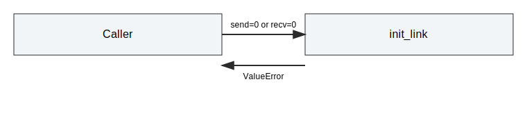
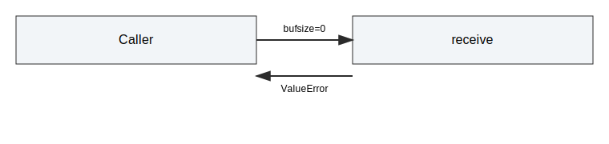

# API Validation Integration Tests

This document describes API validation tests for the Python bindings.
The suite ensures argument validation errors are raised consistently.

## Scope

The tests in tests/integration/test_api_validation.py cover:

- Invalid buffer sizes when initializing a link.
- Invalid receive buffer size.
- Invalid FlowControl parameters.

## Test Cases

### test_init_rejects_zero_buffers

- Setup: attempt to initialize with zero send or receive buffer size.
- Expectation: ValueError is raised.

### test_receive_rejects_invalid_bufsize

- Setup: initialize link with valid buffers.
- Action: call receive with bufsize 0.
- Expectation: ValueError is raised.

### test_set_fc_params_rejects_large_block_size

- Setup: initialize link with valid buffers.
- Action: call set_fc_params with block_size > 255.
- Expectation: ValueError is raised.

## Notes

- These tests validate Python API guards only.
- Update this document if input validation behavior changes.
