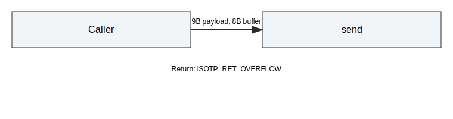
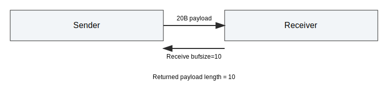
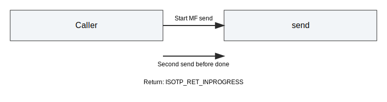

# Buffer Limits Integration Tests

This document describes buffer limit tests for the Python API.
The suite focuses on overflow handling, truncation, and in-progress status.

## Scope

The tests in tests/integration/test_buffer_limits.py cover:

- Sending payloads larger than send buffer.
- Receiving into smaller buffers (truncation).
- Calling send while a transfer is already in progress.

## Test Cases

### test_send_overflow_returns_code

- Setup: link with send buffer size 8.
- Action: send a 9-byte payload.
- Expectation: return code is ISOTP_RET_OVERFLOW.

### test_receive_truncates_payload

- Setup: link with sufficient buffers and a 20-byte payload.
- Action: receive with payload_size 10.
- Expectation: returned payload is truncated to 10 bytes.

### test_send_in_progress_returns_code

- Setup: multi-frame payload to keep sender busy.
- Action: call send again before completion.
- Expectation: second send returns ISOTP_RET_INPROGRESS.

## Notes

- These tests rely on synchronous polling and mock CAN.
- Update if send/receive return codes change.
