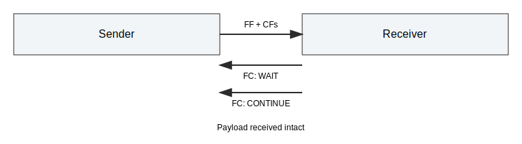

# AUTOSAR CanTp Integration Tests

This document describes the AUTOSAR CanTp-oriented integration tests added for the Python API.
The suite focuses on FlowControl WAIT handling and selected CanTp timing and protocol behaviors.
All tests are deterministic and use mock time.

## Scope

The tests in tests/integration/test_cantp.py cover:

- FlowControl WAIT handling: single WAIT then CONTINUE, and WFT overrun.
- N_Bs and N_Cr timeouts using configurable timeouts.
- STmin and Block Size (BS) flow control parameters.
- Unexpected PDU handling (CF without FF).

## Helper Utilities

The test file defines helpers for clarity and reuse:

- _poll_until_receive: polls until a payload is received or steps are exhausted.
- _make_payload: creates deterministic payloads.
- _fc_frame: builds raw FlowControl frames (FS/BS/STmin).

## Test Cases

### test_wait_frame_then_continue

- Setup: multi-frame payload and injected FC frames.
- Action: inject FC Wait followed by FC Continue.
- Expectation: payload is transmitted and received successfully.

### test_wait_frame_overrun

- Setup: multi-frame payload and injected FC Wait frames.
- Action: inject FC Wait twice (exceeding ISO_TP_MAX_WFT_NUMBER).
- Expectation: sender protocol result is ISOTP_PROTOCOL_RESULT_WFT_OVRN.

### test_cantp_timeout_n_bs

- Setup: N_Bs=30 ms, N_Cr=10 ms, FlowControl disabled.
- Action: send a multi-frame payload, advance mock time.
- Expectation: sender protocol result is ISOTP_PROTOCOL_RESULT_TIMEOUT_BS.

### test_cantp_timeout_n_cr

- Setup: N_Bs=30 ms, N_Cr=10 ms, CAN drop enabled after FF.
- Action: send a multi-frame payload, advance mock time.
- Expectation: receiver protocol result is ISOTP_PROTOCOL_RESULT_TIMEOUT_CR.

### test_cantp_stmin_and_bs

- Setup: BS=1, STmin=5 ms.
- Action: send a multi-frame payload, poll with mock time.
- Expectation: payload is received intact.

### test_cantp_unexpected_pdu

- Setup: default link.
- Action: inject a CF without a prior FF.
- Expectation: receiver protocol result is ISOTP_PROTOCOL_RESULT_UNEXP_PDU.

## Notes

- Raw CAN injection uses pyisotp.inject_can.
- Timing uses mock time via pyisotp.time_advance.
- Update this document if core behavior or timeout defaults change.
