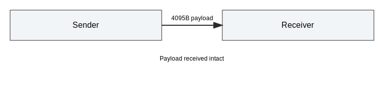
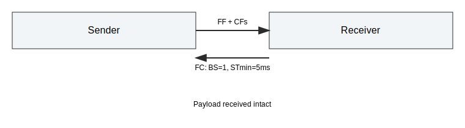
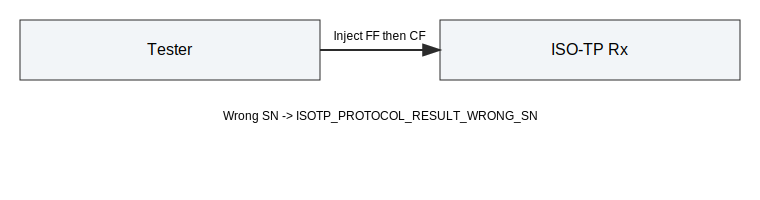

# Multi-Frame Integration Tests

This document describes the multi-frame integration tests for the Python API.
The suite focuses on ISO-TP multi-frame behavior, flow control, timing, and
protocol error handling. All tests are deterministic and rely on mock time.

## Scope

The tests in tests/integration/test_multi_frame.py cover:

- Basic multi-frame roundtrip.
- Boundary payload sizes that switch between single/multi frame logic.
- Maximum payload size (4095 bytes).
- FlowControl parameters: Block Size (BS) and STmin.
- Multi-frame timeouts N_Bs and N_Cr.
- Protocol errors: unexpected CF and wrong sequence number (SN).

## Helper Utilities

The test file defines helpers to keep test logic consistent:

- _poll_until_receive: polls and attempts receive until a payload appears.
- _make_payload: builds deterministic byte payloads.
- _ff_frame / _cf_frame: create raw FF/CF frames for injection.

## Test Cases

### test_multi_frame_roundtrip

- Setup: default link with large buffers.
- Action: send a 12-byte payload (multi-frame).
- Expectation: received payload matches the sent payload.

### test_multi_frame_boundary_sizes

- Setup: default link with larger buffers.
- Action: send sizes 8, 9, 14, and 15 bytes.
- Expectation: each payload is received intact.

### test_multi_frame_max_payload

- Setup: link with 4096-byte buffers.
- Action: send a 4095-byte payload.
- Expectation: received payload matches the sent payload.

### test_multi_frame_bs_one_stmin

- Setup: BS=1 and STmin=5 ms.
- Action: send a multi-frame payload, poll with mock time.
- Expectation: payload is received intact.

### test_multi_frame_bs_unlimited_stmin

- Setup: BS=0 (unlimited) and STmin=5 ms.
- Action: send a multi-frame payload, poll with mock time.
- Expectation: payload is received intact.

### test_multi_frame_timeout_n_bs

- Setup: N_Bs=50 ms, N_Cr=50 ms, FlowControl disabled.
- Action: send a multi-frame payload, advance mock time.
- Expectation: sender protocol result is ISOTP_PROTOCOL_RESULT_TIMEOUT_BS.

### test_multi_frame_timeout_n_cr

- Setup: N_Bs=50 ms, N_Cr=10 ms, CAN drop enabled.
- Action: send a multi-frame payload, advance mock time.
- Expectation: receiver protocol result is ISOTP_PROTOCOL_RESULT_TIMEOUT_CR.

### test_multi_frame_unexpected_cf

- Setup: default link.
- Action: inject a CF without a prior FF.
- Expectation: receiver protocol result is ISOTP_PROTOCOL_RESULT_UNEXP_PDU.

### test_multi_frame_wrong_sn

- Setup: default link.
- Action: inject FF followed by CF with wrong SN.
- Expectation: receiver protocol result is ISOTP_PROTOCOL_RESULT_WRONG_SN.

## Notes

- Raw CAN injection uses pyisotp.inject_can.
- Timing uses mock time via pyisotp.time_advance.
- If FlowControl defaults or protocol rules change, update this document and
  tests together.
