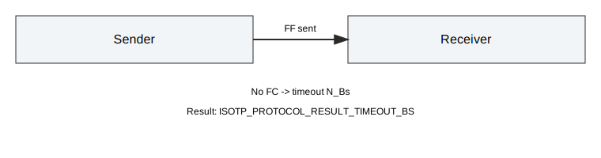
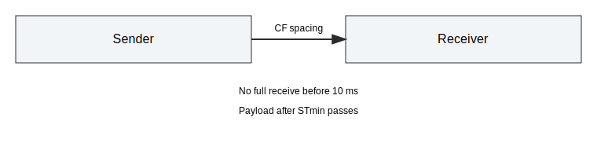
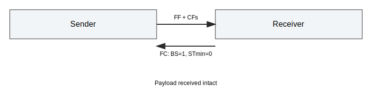

# Timing Tests (ISO-15765-2)

This document describes the timing-related integration tests for the Python API.
The tests use the mock time source and mock CAN driver to keep results deterministic.

## Scope

The timing suite in tests/integration/test_timing.py validates these behaviors:

- N_Bs: max wait time for FlowControl after First Frame (FF).
- N_Cr: max wait time for Consecutive Frame (CF).
- STmin: minimum separation time between CFs.
- Block Size (BS): number of CFs allowed before the next FlowControl.

The following parameters are listed in ISO-15765-2 but are not yet enforced in core,
so they are tracked as xfail placeholders:

- N_As: max time to send a frame.
- N_Ar: max time to confirm transmission.
- N_Br: max time to send FlowControl.
- N_Cs: max time between CF transmissions.

## Parameter Mapping

The core uses per-link parameters configured via the Python API:

- pyisotp.set_timeouts(link, n_bs_ms, n_cr_ms) sets N_Bs and N_Cr (milliseconds).
- pyisotp.set_fc_params(link, block_size, st_min_ms) sets BS and STmin.

These values are stored in the IsoTpLink instance and are used by the protocol
state machine during polling.

## Test Summary

### test_timeout_n_bs

- Setup: set N_Bs to 100 ms, disable FlowControl frames.
- Action: send a multi-frame payload, advance time with poll.
- Expectation: sender protocol result is ISOTP_PROTOCOL_RESULT_TIMEOUT_BS.

### test_timeout_n_cr

- Setup: set N_Cr to 20 ms, enable CAN frame drop to block CF delivery.
- Action: send a multi-frame payload, advance time with poll.
- Expectation: receiver protocol result is ISOTP_PROTOCOL_RESULT_TIMEOUT_CR.

### test_st_min_enforced

- Setup: set STmin to 10 ms, BS unlimited (0).
- Action: send a multi-frame payload, advance time with poll.
- Expectation: no full receive before 10 ms; payload arrives after STmin passes.

### test_block_size_one_roundtrip

- Setup: set BS to 1, STmin 0.
- Action: send a multi-frame payload, poll until receive completes.
- Expectation: full payload is received.

### xfail placeholders

The following tests are present but expected to fail until core support exists:

- test_timeout_n_as_placeholder
- test_timeout_n_ar_placeholder
- test_timeout_n_br_placeholder
- test_timeout_n_cs_placeholder

## Notes

- All tests use mock time (pyisotp.time_advance) and do not sleep.
- If you change default timeouts or FlowControl behavior, update this document
  and the tests together.
